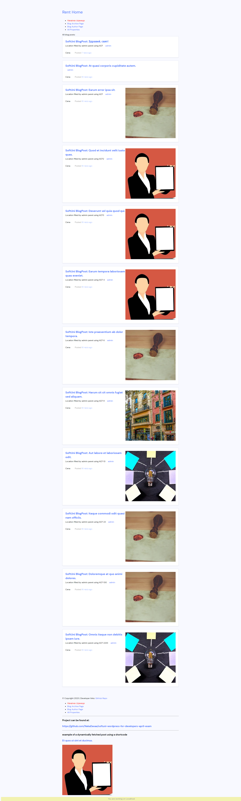
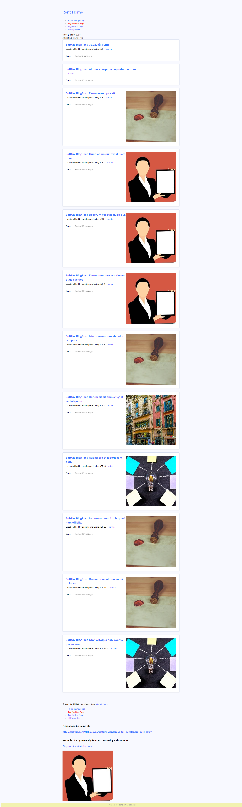
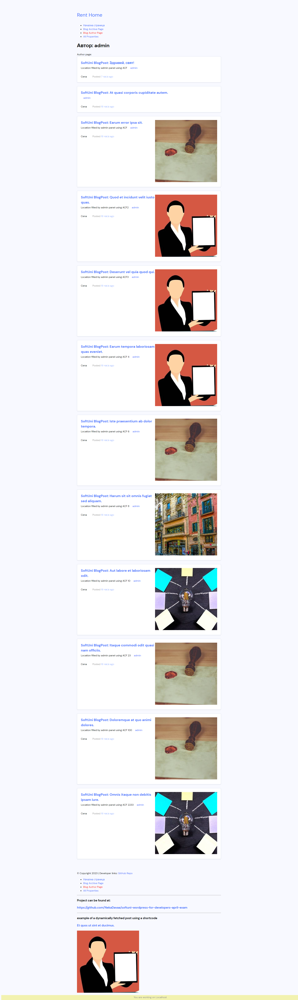
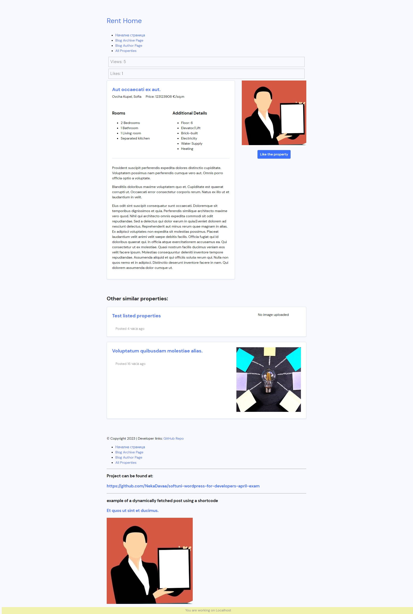

<div class="image-row" style="display: flex;justify-content: center;gap: 20px;">




</div>


# SoftUni Properties to Rent - WordPress Project

This project is created for the SoftUni WordPress for Developers exam. The project focuses on creating a platform for showcasing rental properties, implementing custom post types, Advanced Custom Fields (ACF), Object-Oriented Programming (OOP) principles, and SASS for styling.

You can access the site via https://projects.miagod.com/properties/

## Features

- Custom Post Type for Properties
- Advanced Custom Fields integration
- WordPress Coding Standards-compliant OOP implementation
- SASS for styling
- Property views and likes counters
- AJAX-based likes functionality

## Installation

1. Clone the repository into your wp-content folder in your WordPress installation:
```git clone https://github.com/NekaDavaa/softuni-wordpress-for-developers-april-exam.git```

2. Import sql database 

3. Activate the theme and plugin from the WordPress dashboard.  

4. You might need to update the permalinks (http://localhost/sample-post/), create a new homepage and an "All Properties" page using the templates I've designed, and generate some dummy posts for both post types.


5. Install and activate the ```Advanced Custom Fields (ACF) plugin.``` This is ```required``` for the project to work correctly. (https://wordpress.org/plugins/advanced-custom-fields/)

#
# Greetings

Благодаря за курса, беше изключително приятно изживяване. Поздрави на лектора и честит 1-ви май.
П.П. Извинявам се за бъркотията; следващия път ще подредя всичко в template-parts. Очаквам втората част с нетърпение.


